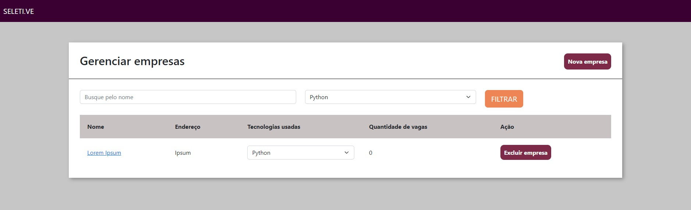
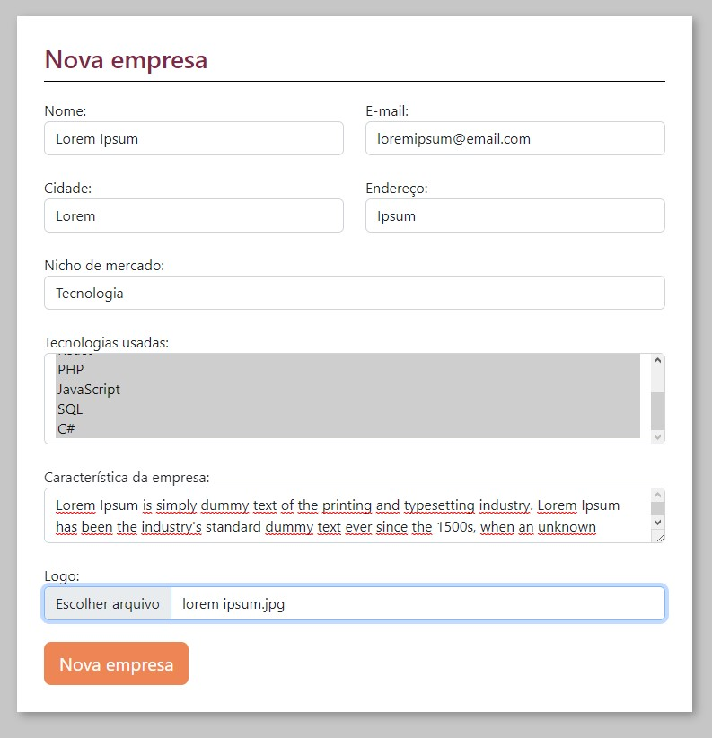
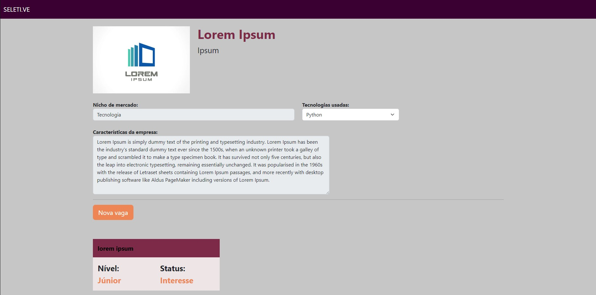
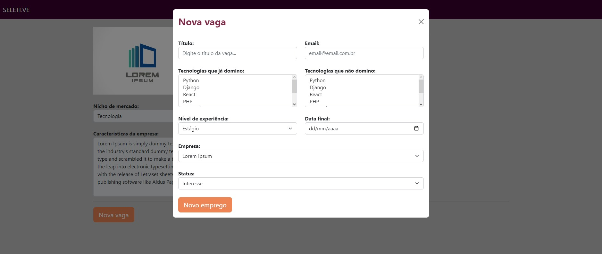
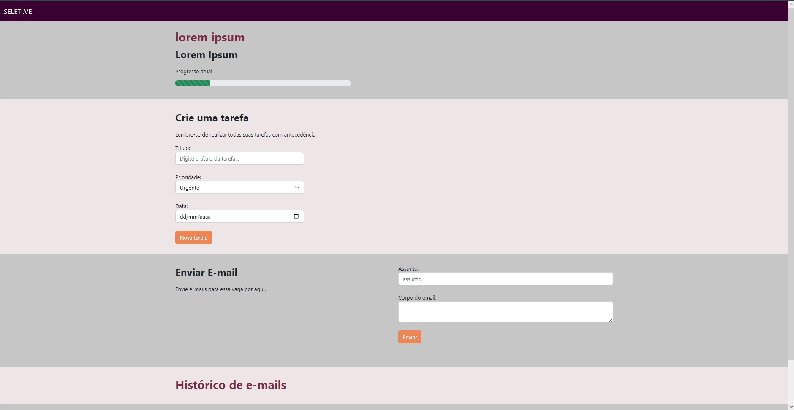
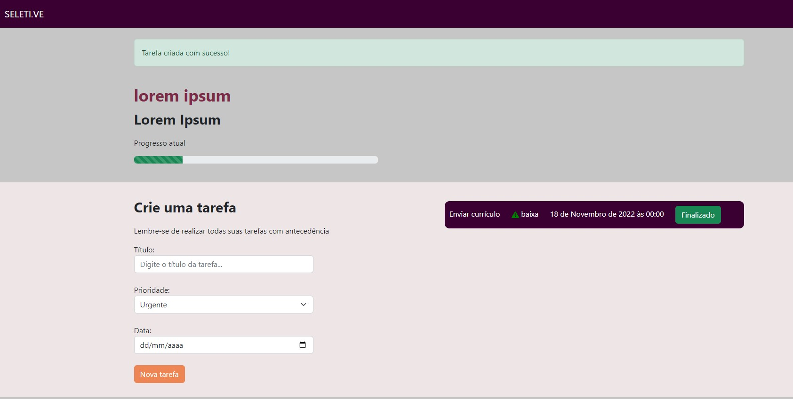
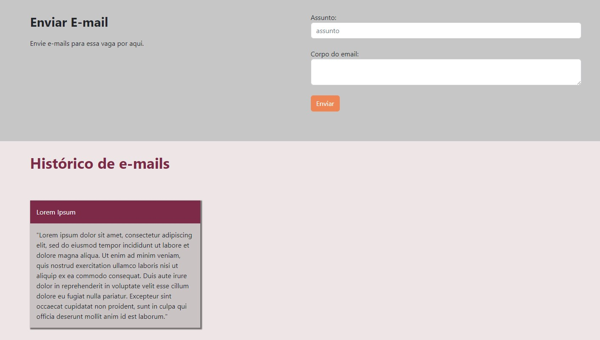

<p align="center">
  <a href="https://www.djangoproject.com" target="blank"></a>
</p>

<p align="center">
  <a href="#-tecnologias">Tecnologias</a>&nbsp;&nbsp;&nbsp;|&nbsp;&nbsp;&nbsp;
  <a href="#-projeto">Projeto</a>&nbsp;&nbsp;&nbsp;|&nbsp;&nbsp;&nbsp;
  <a href="#-como-executar">Como executar</a>
</p>


<hr>

<a id="-tecnologias"></a>

## Tecnologias

Esse projeto foi desenvolvido com as seguintes tecnologias:


<hr>

<a id="-projeto"></a>

## 💻 Projeto

O projeto Seletive é uma ideia de aplicação desenvolvida para pessoas que procuram uma forma de organizar as vagas de emprego as quais tem interesse, a plataforma tem como objetivo facilitar essa ação.

<p align="center">
  
</p>

<p align="center">
  
</p>

<p align="center">
  
</p>

<p align="center">
  
</p>

<p align="center">
  
</p>

<p align="center">
  
</p>

<p align="center">
  
</p>

<a id="-como-executar"></a>

## 🚀 Como executar

### 💻 Pré-requisitos
 **Antes de começar, verifique se você atendeu aos seguintes requisitos:**

- Você tem uma máquina `< Windows / Linux / Mac >`.

- Você tem python na versão 3.11 ou superior instalado em sua máquina.


### Como instalar localmente:

- clone ou baixe o repositório.

Com o ambiente virtual ativo:

- Acesse a pasta do projeto no terminal execute:

```console
cd seletive
cp env .env
python -m pip install poetry
poetry install
```

**OBS. Não se esqueça de alterar o arquivo .env que foi gerado a partida da cópia de exemplo "env" que vem na raíz do projeto.**

### Para total funcionamento da aplicação ainda é necessário fazer as migrações para gerar o esquema de banco de dados:

```console
python manage.py migrate
``` 

### Criando um usuário para acessar o painel de administração:

```console
python manage.py createsuperuser
```

## 👨‍💻 Ativando a aplicação (localmente)
Para executar o servidor localmente (Com o ambiente virtual ativo):

```console
python manage.py runserver
```

Agora é possível acessar a aplicação em http://localhost:8000/
